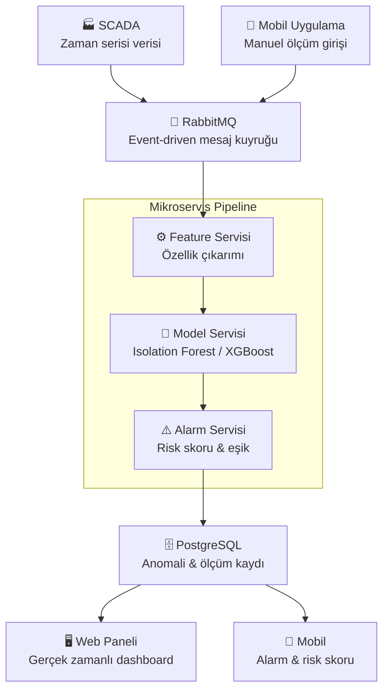

# 🌬️ WIND Sentinel
Event-Driven Microservice Architecture for Early Fault Detection in Wind Turbines Using SCADA Data and Field Measurements

## Nedir?

WIND Sentinel, hem SCADA zaman serisi verilerini hem de saha teknisyenlerinin mobil uygulama üzerinden girdiği manuel ölçümleri (titreşim, sıcaklık, güç üretimi) analiz ederek arıza risk skorları üretir. Bakım ekipleri potansiyel arızaları önceden tespit edebilir ve operasyonel maliyetleri azaltabilir.

## Nasıl Çalışır?

Ölçüm verileri RabbitMQ üzerinden mikroservis pipeline'ına girer. Sırasıyla feature çıkarımı, model tahmini ve alarm üretim aşamalarından geçerek gerçek zamanlı olarak web paneline ve mobil uygulamaya yansıtılır.

## Özellikler

-  SCADA zaman serisi verisi ile entegrasyon
-  Mobil uygulama üzerinden manuel ölçüm girişi
-  Isolation Forest & XGBoost ile anomali tespiti
-  Eşik tabanlı uyarı ve alarm sistemi
-  Gerçek zamanlı web paneli
-  PR-AUC ve false alarm metrikleri ile model değerlendirme
-  

