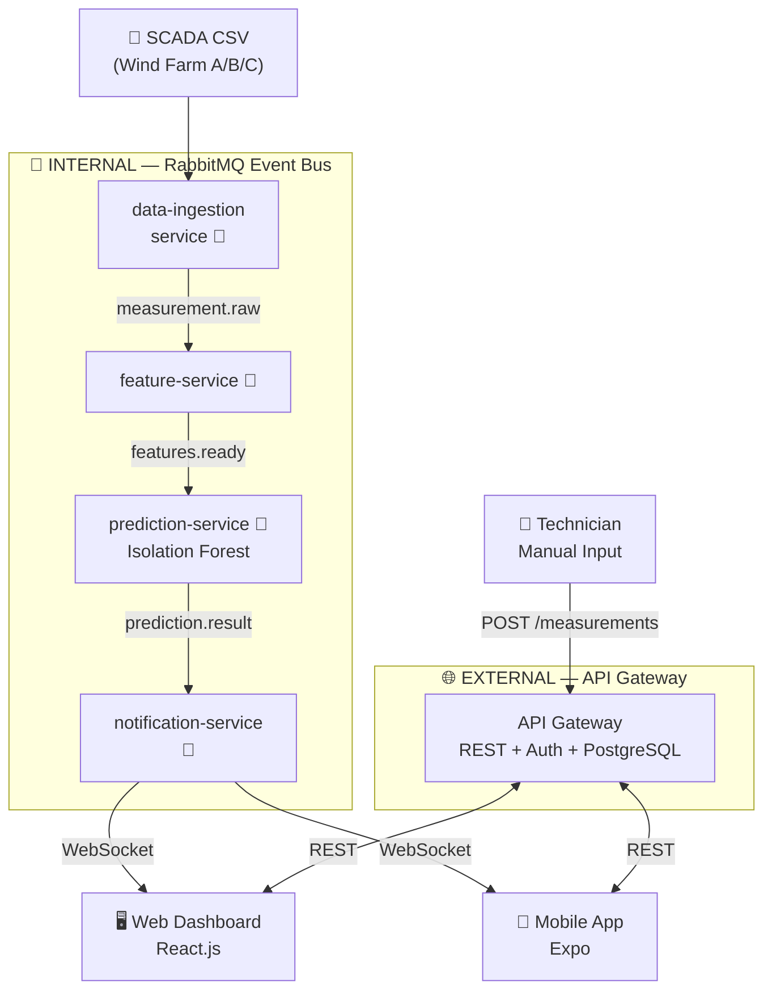

# 🌀 WIND Sentinel

AI-powered early fault detection system for wind turbines using event-driven microservice architecture.

## Problem

Wind turbines experience unexpected failures that cause costly downtime. Traditional maintenance is either reactive (fix after failure) or scheduled (wasteful). This project uses AI to predict failures before they happen, enabling condition-based maintenance.

## Solution Overview

The system has two independent communication layers:
- **RabbitMQ** — internal event bus between microservices
- **API Gateway** — external interface for web/mobile clients

## 🏗️ Architecture

## How It Works (Data Pipeline)

The system processes data through 4 microservices connected via RabbitMQ:

### Step 1: Data Ingestion Service
- Receives SCADA sensor data (10-min intervals) or manual technician measurements
- Validates and stores raw data
- Publishes `measurement.raw` event to RabbitMQ

### Step 2: Feature Service
- Listens for `measurement.raw` events
- Extracts features: rolling averages, standard deviations, trends, rate of change
- Publishes `measurement.features` event

### Step 3: Prediction Service
- Listens for `measurement.features` events
- Runs Isolation Forest / XGBoost models to calculate risk scores (0-100)
- Publishes `prediction.result` event

### Step 4: Notification Service
- Listens for `prediction.result` events
- If risk score > threshold → creates alert
- Sends real-time alerts via WebSocket to web dashboard
- Sends push notifications to mobile app

## What is a Microservice?

Traditional apps are **monolithic** — one big codebase does everything. Microservices split the app into small, independent services that communicate via messages.

```
MONOLITHIC (Traditional)          MICROSERVICES (Our Approach)
┌──────────────────────┐          ┌────────┐  ┌────────┐  ┌────────┐
│  Data Processing     │          │ Data   │  │Feature │  │Predict │
│  Feature Extraction  │   vs     │Ingest  │──│Service │──│Service │
│  ML Prediction       │          └────────┘  └────────┘  └────────┘
│  Notifications       │          ┌────────┐  ┌────────┐
│  API                 │          │Notif.  │  │  API   │
└──────────────────────┘          │Service │  │Gateway │
                                  └────────┘  └────────┘
```

**Why microservices?**
- Each service can be developed/deployed independently
- If prediction service crashes, data ingestion still works
- Each service can use the best language for its job (Python for ML, Node.js for real-time)
- Easy to scale: need more prediction power? Just add more prediction service instances

## What is RabbitMQ?

RabbitMQ is a **message broker** — it sits between services and passes messages. Think of it like a post office:

```
Producer (sender)  →  RabbitMQ Queue  →  Consumer (receiver)

Data Ingestion     →  [measurement.raw]     →  Feature Service
Feature Service    →  [measurement.features] →  Prediction Service
Prediction Service →  [prediction.result]    →  Notification Service
Notification       →  [alert.created]        →  API Gateway (WebSocket)
```

**Why not direct HTTP calls between services?**
- If Feature Service is down, messages wait in the queue (no data loss)
- Services don't need to know each other's addresses
- One message can be consumed by multiple services

## Dataset

We use the **CARE wind turbine SCADA dataset** (Wind Farm A — EDP Open Data):

| Property | Value |
|----------|-------|
| Source | EDP Open Data (Portugal, onshore) |
| Turbines | 5 wind turbines |
| Datasets | 22 events (balanced: anomaly + normal) |
| Features | 86 sensors (avg, min, max, std) |
| Frequency | 10-minute intervals |
| Key Columns | `sensor_x_avg`, `status_type`, `train_test` |

### Status Types
| ID | Meaning |
|----|---------|
| 0 | Normal Operation |
| 1 | Derated Operation |
| 2 | Idling |
| 3 | Service |
| 4 | Downtime (fault) |
| 5 | Other |

## Project Structure

```
wind-sentinel/
├── docker-compose.yml          # Infrastructure (RabbitMQ, PostgreSQL)
├── .env                        # Environment variables
├── .gitignore
├── README.md
├── data/
│   ├── raw/                    # SCADA dataset (Wind Farm A)
│   │   └── Wind Farm A/
│   │       ├── datasets/       # 22 event CSV files (~36MB each)
│   │       ├── event_info.csv  # Anomaly/normal labels
│   │       └── feature_description.csv
│   └── processed/              # Feature engineering outputs
└── services/
    ├── data-ingestion-service/ # Python/FastAPI — receives & stores measurements
    ├── feature-service/        # Python/FastAPI — extracts ML features
    ├── prediction-service/     # Python/FastAPI — runs anomaly detection models
    ├── notification-service/   # Node.js — alerts via WebSocket & push
    └── api-gateway/            # Node.js/Express — REST API + auth
```

## Tech Stack

| Layer | Technology | Why |
|-------|-----------|-----|
| API Gateway | Node.js + Express | Fast, WebSocket support |
| Data Ingestion | Python + FastAPI | Same language as ML services |
| Feature Service | Python + FastAPI | pandas/numpy for feature engineering |
| Prediction Service | Python + FastAPI | scikit-learn, XGBoost |
| Notification Service | Node.js | WebSocket + push notifications |
| Web Dashboard | React (Vite) | Fast dev, recharts for graphs |
| Mobile App | React Native (Expo) | Single codebase for iOS + Android |
| Message Broker | RabbitMQ | Event-driven pipeline |
| Database | PostgreSQL | Users, alerts, config |
| ML Models | Isolation Forest, XGBoost | Anomaly detection |

## Infrastructure

| Service | Port | Credentials |
|---------|------|-------------|
| RabbitMQ AMQP | 5672 | admin / admin123 |
| RabbitMQ UI | 15672 | admin / admin123 |
| PostgreSQL | 5434 | admin / admin123 |

## Quick Start

```bash
# Start infrastructure
docker compose up -d

# Verify containers
docker ps

# Open RabbitMQ UI
# http://localhost:15672
```

## API Contracts

### REST Endpoints (API Gateway — port 8000)

| Method | Endpoint | Body | Response | Description |
|--------|----------|------|----------|-------------|
| POST | `/api/auth/register` | `{ email, password, name, role }` | `{ token, user }` | User registration |
| POST | `/api/auth/login` | `{ email, password }` | `{ token, user }` | Login |
| GET | `/api/turbines` | - | `[ { id, name, location, status } ]` | List turbines |
| GET | `/api/turbines/:id` | - | `{ id, name, location, status, lastMeasurement }` | Turbine detail |
| POST | `/api/measurements` | `{ turbineId, vibration, temperature, power, windSpeed }` | `{ id, timestamp, riskScore }` | Submit measurement |
| GET | `/api/measurements/:turbineId` | - | `[ { timestamp, vibration, temperature, power } ]` | Measurement history |
| GET | `/api/predictions/:turbineId` | - | `[ { timestamp, riskScore, anomalyType } ]` | Prediction results |
| GET | `/api/alerts` | - | `[ { id, turbineId, severity, message, createdAt } ]` | List alerts |
| WS | `/ws/alerts` | - | Real-time `{ turbineId, severity, message }` | Live alert stream |

### RabbitMQ Events

| Queue | Producer | Consumer | Payload |
|-------|----------|----------|---------|
| `measurement.raw` | data-ingestion | feature-service | `{ turbineId, timestamp, vibration, temperature, power, windSpeed }` |
| `measurement.features` | feature-service | prediction-service | `{ turbineId, timestamp, features: { rollingAvg, std, trend } }` |
| `prediction.result` | prediction-service | notification-service | `{ turbineId, timestamp, riskScore, anomalyType, confidence }` |
| `alert.created` | notification-service | api-gateway | `{ turbineId, severity, message, createdAt }` |

## ML Approach

### Models
- **Isolation Forest**: Unsupervised anomaly detection — learns "normal" behavior, flags outliers
- **XGBoost**: Supervised classification — trained on labeled anomaly/normal events

### Evaluation Metrics
- **PR-AUC** (Precision-Recall Area Under Curve): Main metric for imbalanced data
- **False Alarm Rate**: How often the system incorrectly triggers an alert
- **Lead Time**: How far in advance the system detects an upcoming failure

## Roadmap

| Week | Goal |
|------|------|
| 1 | Project setup, Docker infrastructure, dataset, README |
| 2 | Data Ingestion + Feature Service + Prediction Service |
| 3 | Notification Service + WebSocket real-time alerts |
| 4 | Web Dashboard + Mobile App |
| 5 | Testing, metrics (PR-AUC, false alarm), documentation |
